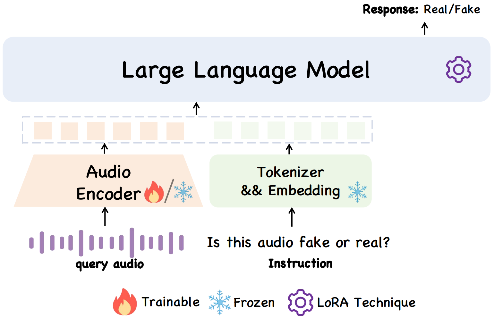

[](https://arxiv.org/abs/2505.11079) 

<p align="center">
  
</p>

<h1 align="center">ALLM4ADD: Unlocking the Capabilities of Audio Large Language Models for Audio Deepfake Detection</h1>

<p align="center">
  <em>[ACMMM2025] Official code for ALLM4ADD</em>
</p>

<p align="center">
  Hao Gu<sup>1</sup>, Jiangyan Yi<sup>2†</sup>, Chenglong Wang<sup>3</sup>, Jianhua Tao<sup>2</sup>,  
  Zheng Lian<sup>1</sup>, Jiayi He<sup>1</sup>, Yong Ren<sup>1</sup>, Yujie Chen<sup>4</sup>, Zhengqi Wen<sup>5</sup>
</p>

<p align="center">
<sup>1</sup>Institute of Automation, Chinese Academy of Sciences, Beijing, China  
<sup>2</sup>Department of Automation, Tsinghua University, Beijing, China  
<sup>3</sup>Taizhou University, Taizhou, China  
<sup>4</sup>Anhui University, Hefei, China  
<sup>5</sup>Beijing National Research Center for Information Science and Technology, Tsinghua University, Beijing, China  
†Corresponding author.
</p>


## Good News
🔥[2025/7/5] Our work has been finally accepted by ACMMM 2025. This is the first work that fake audio detection with Audio LLM


## 🎯 Environment:
Install dependencies:
```shell
conda create -n qwen_audio_sft python=3.10
conda activate qwen_audio_sft
pip install -r requiremet.txt
pip install deepspeed==0.10.3
```

## 🎯 Dataset: 

You should first prepare the dataset as in data/asv_fake_audio.jsonl:
```shell
{"messages": [{"role": "user", "audio": "/data3/renyong/xule/ASVspoof2019/LA/train/wav/LA_T_4132181.wav",
            "content": "Is this audio real or fake?"}, {"role": "assistant", "content": "Fake."}]}
```

## 🎯 Train
```shell
bash audio_8.sh
```

## 🎯 Infer eer
```shell
python infer_eer_8.py
```

## 🎯 If you want to train the audio encoder
```shell
finetune.py ---> frozen the audio encoder
finetune_audio.py ---> train the audio encoder
```

after you train the audio encoder, check the infer_eer_8.py
```shell
# non_lora_trainables = torch.load(os.path.join(peft_model_id, 'non_lora_trainables.bin'), map_location='cpu')
# non_lora_trainables = {(k[11:] if k.startswith('base_model.') else k): v for k, v in non_lora_trainables.items()}
# non_lora_trainables = {(k[6:] if k.startswith('model.') else k): v for k, v in non_lora_trainables.items()}
# merged_model.load_state_dict(non_lora_trainables, strict=False)
```
to
```shell
non_lora_trainables = torch.load(os.path.join(peft_model_id, 'non_lora_trainables.bin'), map_location='cpu')
non_lora_trainables = {(k[11:] if k.startswith('base_model.') else k): v for k, v in non_lora_trainables.items()}
non_lora_trainables = {(k[6:] if k.startswith('model.') else k): v for k, v in non_lora_trainables.items()}
merged_model.load_state_dict(non_lora_trainables, strict=False)
```
Then you can inference the speech llm that audio encoder is trainable

## 🙏 Acknowledgement
We are thankful to LLaVA, Qwen-audio for releasing their models and code as open-source contributions.
